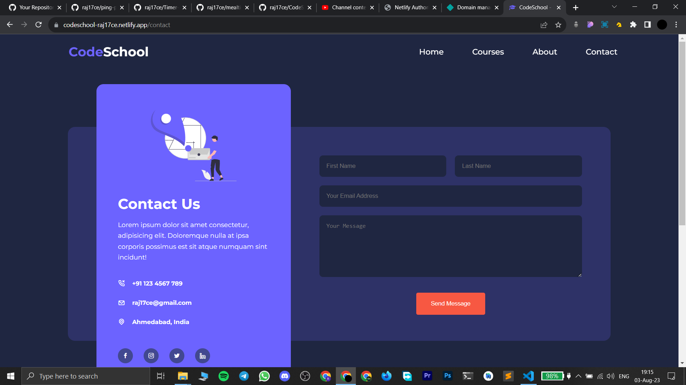

# CodeSchool

### [Live Link](https://codeschool-raj17ce.netlify.app/)

#### This is a multipage website designed using pure HTML, CSS and a bit of JavaScript.

## Functionalities

- A simple multipage website.

- Completely Responsive.

- Made using custom CSS.

## Tech Stack

- `HTML` for making the layout of the website.

- `CSS` for styling the website.

- Modern features of `CSS` like flexbox and media queries are used in this project.

- `Formspree` to get the form response on email.

## Video Demo

Click on this thumbnail to watch the video.

## ScreenShot

 

